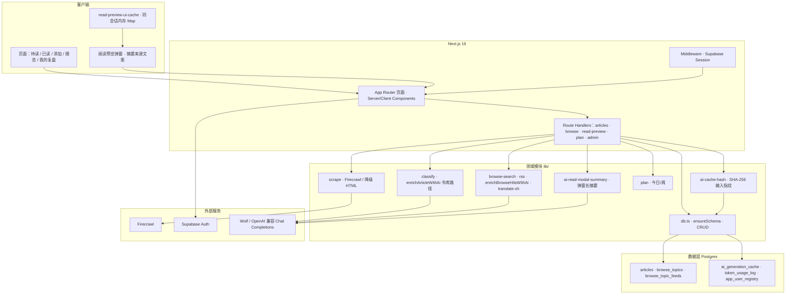
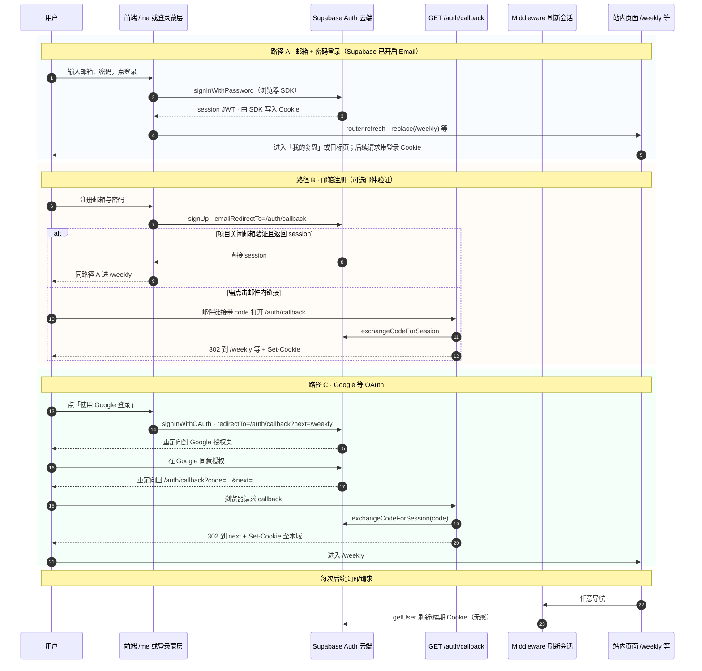
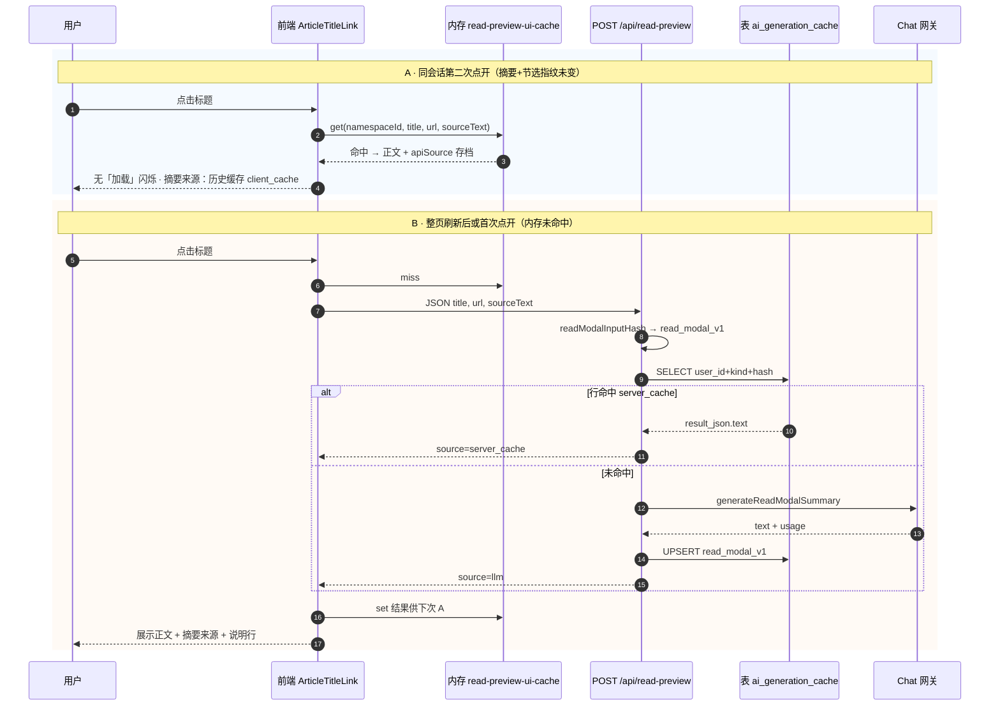
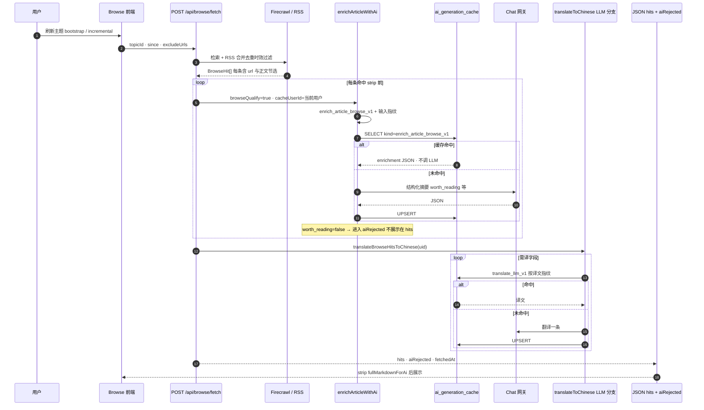
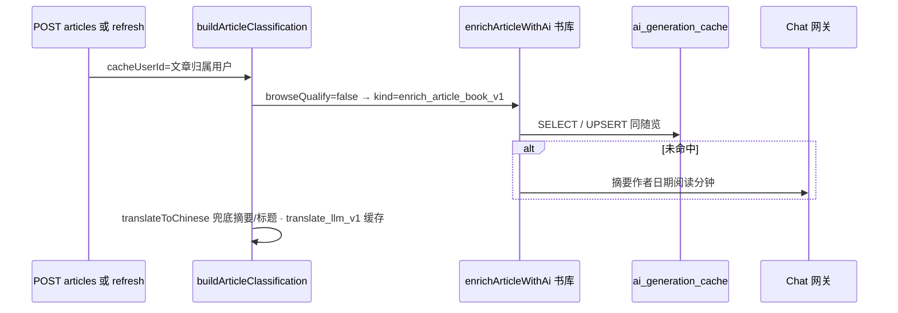

# 阅读计划（Reading Plan）产品需求文档 PRD

文档版本：v1.3  
产品形态：Web App（移动端优先，可添加至主屏幕）  
技术栈摘要：Next.js 16 App Router、React 19、TypeScript、Supabase Auth + Postgres、Firecrawl、可选 Wolf/OpenAI 兼容网关  

---

## 0. 导读：双轨阅读（人话 + 技术）

全文采用**两条轨道**并行：

| 轨道                  | 写给谁             | 写什么                     |
| ------------------- | --------------- | ----------------------- |
| **人话版**（引用块或「人话」小节） | 产品、运营、业务方、未来的自己 | 这件事对用户意味着什么、日常怎么用、感受一下啥 |
| **正文技术描述**          | 研发、测试、架构对照      | 模块名、接口、表、配置，便于落地与排障     |

**一句话人话（整款产品）**  

可以把「阅读计划」想成：**收藏夹 Pro**。你不用把全文复制进来——贴一个链接，它尽量帮你把文章捞进来、写好一行摘要、猜要花几分钟读完，并按「今天该读啥」排好序。读完不是点个勾就完事，而是逼你用一句话、三点收获、一件下一步行动把东西带走，避免「看过算过」。另一条腿叫「随览」：像按你关心的话题去网上逛一圈，看看最近有啥值得读，AI 帮你啃摘要、挡掉明显掺水的页面。你愿意登录的话，书单跟你人走；AI 生成过的东西会记下来，同样的内容尽量不重复烧钱。

---

## 1. 产品概述

### 1.1 一句话描述

面向知识工作者的**链接型阅读管理工具**：粘贴文章 URL，自动抓取与归类，结合 AI 生成摘要与元数据；按「今日待读 / 已读复盘 / 主题随览」组织闭环，并支持账号隔离与用量治理。

> **人话**  
> 你不是来「管理文件」的，是来**管理注意力**的：链接扔进来，剩下的排序、摘要、读完打卡尽量自动化；「随览」负责帮你从海里捞鱼，书库负责把鱼按你的节奏煮熟吃掉。

### 1.2 目标用户

- 日常通过浏览器收藏大量长文、报告，需要**排期阅读**与**轻量复盘**的知识工作者、产品经理、研发与研究者。
- 希望通过**主题订阅式浏览**（随览）发现高质量外文或分散来源内容，并一键转入书库的用户。

> **人话**  
> 一类是「囤了很多收藏夹从来不去读」的人——需要有人帮排优先级和截止感。一类是「主动追某个领域」的人——随览像个性化资讯雷达，但读完仍回到你自己的书单体系里。

### 1.3 核心价值

| 价值     | 说明                                         |
| ------ | ------------------------------------------ |
| 降低入库成本 | URL 一键添加，自动抓取正文、主题、时长、摘要                   |
| 阅读决策   | 今日列表按截止日与深度排序，区分精读与扫览                      |
| 外源发现   | 随览按主题 + Firecrawl 检索 / RSS，可选 AI 摘要与筛除低价值页 |
| 闭环复盘   | 标记已读时强制一句话总结、三点收获、一个行动项                    |
| 成本可控   | AI 结果服务端与客户端多级缓存，减少重复调用                    |

> **人话对照表**  
> 「降低入库成本」= 少打字、少复制粘贴。「阅读决策」= 帮你判断今天先啃哪篇长的、哪篇扫一眼就行。「外源发现」= 不必自己逛十几个站点。「闭环复盘」= 读完必须留下一句带走，防止假读完。「成本可控」= 同样一篇文章别让 AI 一遍遍重写摘要。

### 1.4 非目标（当前版本不做）

- 不做全文离线阅读器替代浏览器排版引擎的精细排版控制。
- 不做团队协作、多人共享书单（数据模型以单用户为主）。
- 不保证所有站点可抓取（受 robots、反爬、登录墙限制）。

> **人话**  
> 不做「第二个 Notion 排版器」，也不做「和同事共享书单」。有些付费墙、登录才能看的页面，这里和大家一样——抓不全就别纠结，换一篇或自己下载后再贴。

---

## 2. 信息架构与导航

底栏五入口（`/src/components/Tabbar.tsx`）：

| 入口  | 路径        | 说明                                |
| --- | --------- | --------------------------------- |
| 待读  | `/`       | 今日计划与待读列表，卡片左滑可标记已读               |
| 已读  | `/read`   | 已完成阅读与读后笔记展示                      |
| 添加  | `/add`    | 粘贴 URL，抓取并写入书库                    |
| 随览  | `/browse` | 按主题联网检索 + RSS，卡片同步书库状态            |
| 我的  | `/weekly` | 「我的复盘」周视图；未登录时账号入口在 `/me` 跳转逻辑中处理 |

补充页面：`/all` 全部筛选、`/admin` 管理员看板（邮箱白名单）、静态预览页等。

> **人话 · 底栏怎么理解**  
> **待读** = 你今天欠的阅读债。**已读** = 你兑现了的债，附带读后感。**添加** = 往债本上登一条新债。**随览** = 出门逛逛菜市场有啥新菜（不一定要买回家）。**我的**（进复盘页）= 这周吃了多少、账号在哪——未登录时先去账号页登录，避免书单长在别人的田里。

---

## 3. 图示（两张独立图）

> **人话 · 这一章回答两个问题**  
> **3.1** 像「房子结构图」：卧室厨房水管在哪（谁在干活、数据睡在哪）。**3.2** 像「出门买菜路线图」：你从按下按钮到吃进嘴里，中途路过哪些店（登录、点标题、刷随览、加文章各走哪条链）。看不懂图没关系，看每段下面的**人话**即可。

### 3.1 系统架构图（分层与依赖）

仅描述**运行时组件与数据去向**，不包含业务流程。

> **人话 · 这张图怎么读**  
> 从上往下看：**你手机屏幕上的界面**说话给 **网站服务器**听；服务器里有一群专门干脏活的模块（抓网页、算读几分钟、问 AI）；脏活有时要外包给 **外面几家公司**——Firecrawl 帮你捞网页、Supabase 管账号、Postgres 替你存笔记、Wolf 那家帮你写摘要。**双层缓存**那句话的意思：能不改写就不改写，省钱省时间。

### 3.2 泳道流程图（跨角色时序）

按**参与者**分工：用户 → 浏览器/前端 → 本应用 Route 与业务逻辑 → Postgres / 外部 SaaS。下列 **4 组** 时序图分别覆盖**登录**、**阅读预览**、**随览刷新**、**书库分类**；每张图后附**文字说明**（用户侧体验、打交道的服务）。

> **人话 · 四段泳道各自干嘛**  
> （1）**登录**：证明你是你，书单才会跟你姓。（2）**点标题**：先看一篇「浓缩版」再决定要不要跳原文。（3）**刷随览**：上网搜一圈 + 可能 AI 帮你摘要和翻译。（4）**加进书库**：把链接变成一张卡片，顺便打好标签。

---

#### （1）注册与登录（邮箱 · OAuth · 回调）

**用户侧会经历什么**

- 未配置 Supabase 环境变量时：应用可退化为**无账号模式**（见 README），本图流程不生效或部分入口隐藏。
- **路径 A**：在「我的」页或全屏蒙层里填邮箱密码；成功则几乎立刻进入已登录态，常见落地 `**/weekly`**（我的复盘）。
- **路径 B**：注册后若需验证邮箱，用户要离开站点去**邮箱客户端**点链接，再回到浏览器完成会话；若管理员关闭验证则等同路径 A。
- **路径 C**：会暂时离开本站到 **Google** 账号页，授权后回到本站 `**/auth/callback`**，再跳转到 `next`（默认复盘页）。若 `exchangeCode` 失败会带 `auth_error` 重定向。

**与哪些服务打交道**

| 交互方                                     | 作用                                                                                |
| --------------------------------------- | --------------------------------------------------------------------------------- |
| **Supabase Auth（云端）**                   | 校验邮箱密码、OAuth、签发 JWT / refresh token、邮件验证链接指向的换票。                                  |
| **本应用 `GET /auth/callback`**            | 用 `code` **换会话**并把 Cookie 写在**重定向响应**上，避免丢会话。                                     |
| **Next.js Middleware**（`updateSession`） | 每次请求调用 `getUser()`，**刷新/续期**浏览器里的 Supabase Cookie，用户无感。                           |
| **Google（OAuth 时）**                     | 仅路径 C；用户在其页面登录与授权。                                                                |
| **自建 Postgres**                         | 登录本身不写业务库；业务 API 在收到请求后按 **Cookie 中的用户 id** 读写 `articles` 等（与 Supabase 用户 id 对齐）。 |

---

#### （2）阅读预览：同会话二次点开 vs 刷新后首次请求

**用户侧会经历什么**

- **块 A（同一会话里第二次点同一标题）**：弹窗**几乎立即**出现正文，通常**不生硬加载**；摘要来源显示为「历史缓存」（client）。前提是摘要+节选相对上次打开**未变**。
- **块 B（首次点开，或刷新了整个网页后再点）**：会先看到**中性加载文案**，再在数百毫秒内或数秒内出现正文（取决于走 Postgres 缓存还是实时调用 Wolf）。关闭弹窗再开且仍在本会话内，则下次回到块 A。
- 若未配置数据库：服务端无法落 `read_modal_v1`，每次未命中都会打 LLM（若有密钥）；客户端内存仍可减轻同会话重复。

**与哪些服务打交道**

| 交互方                                    | 作用                                                          |
| -------------------------------------- | ----------------------------------------------------------- |
| **浏览器内存 Map**（`read-preview-ui-cache`） | 仅块 A；**不向任何服务器发请求**。                                        |
| `**POST /api/read-preview`**（本应用）      | 校验 URL、拼指纹、决定查库或调模型。                                        |
| **Postgres `ai_generation_cache`**     | `kind=read_modal_v1`；命中则不再调用 Wolf。                          |
| **Wolf / OpenAI 兼容网关**                 | `generateReadModalSummary`；生成成功后写入缓存并可能记 `token_usage_log`。 |

---

#### （3）随览刷新：单条 enrich 缓存与翻译 LLM 缓存

**用户侧会经历什么**

- 在随览页选择主题并**下拉或点刷新**：列表进入加载态，随后出现卡片流；若开启筛除，部分条目不会出现在列表但可在「筛除记录」类入口查看。
- **首次**刷某主题或结果集里全是新 URL：等待时间相对长（Firecrawl + 每条可能 Wolf + 翻译）。
- **再次刷新**：若命中 URL 与正文指纹与历史上一致，对应条目 enrich/翻译可能**明显更快**（读库）；但检索结果集合每次仍依赖 Firecrawl/RSS，**仍会发起检索请求**。
- 缺 `FIRECRAWL_API_KEY` 时：可能仅 RSS、或整页报错提示配置密钥（见接口返回）。

**与哪些服务打交道**

| 交互方                                        | 作用                                                                                                                         |
| ------------------------------------------ | -------------------------------------------------------------------------------------------------------------------------- |
| `**POST /api/browse/fetch`**               | 编排检索、AI、翻译并返回 JSON。                                                                                                        |
| **Firecrawl**                              | 按主题关键词等在 Web 上检索、抓取摘要与正文片段；受配额与站点可达性限制。                                                                                    |
| **RSS**（各种子站 HTTP）                         | `fetchBrowseRssHits` 拉取条目，与搜索合并。                                                                                           |
| **Postgres**                               | `browse_topics` 读配置；`ai_generation_cache` 存 enrich 与 `translate_llm_v1`；用户注册表等；可选 `browse_topic_feeds` 由前端 PUT 同步（非本图主路径）。 |
| **Wolf / LLM**                             | 随览条目的结构化摘要、worth_reading；翻译链上未命中缓存的句子。                                                                                     |
| **免费翻译后备**（MyMemory / Lingva / Google gtx） | 当不走 LLM 翻译或 LLM 关闭时可能触发（见 `translate-zh.ts`），本图略。                                                                          |

---

#### （4）书库添加 / 刷新文章（书库 enrich，非随览）

**用户侧会经历什么**

- **添加文章**：在「添加」页粘贴 URL 并提交后，等待抓取与分类完成，再跳回待读或列表；若站点难抓，摘要可能较差或为节选。
- **刷新某篇文章**（菜单内）：重新抓取正文并更新主题、摘要等字段；用户感知为短加载后卡片信息变化。
- 未登录且开启强制登录时：添加/刷新接口会拒绝（见产品策略）；登录后数据进入**当前账号**下的 `articles`。

**与哪些服务打交道**

| 交互方                                           | 作用                                                                 |
| --------------------------------------------- | ------------------------------------------------------------------ |
| `**POST /api/articles` 或 `POST .../refresh`** | 调 `scrapeUrl`、写库、触发分类。                                             |
| **Firecrawl / 降级 fetch**                      | 与随览类似，对**单 URL** 抓取正文（`lib/scrape.ts`）。                            |
| **Postgres `articles`**                       | 持久化书库行；`user_id` 归属。                                               |
| **Postgres `ai_generation_cache`**            | `enrich_article_book_v1` 与 `translate_llm_v1`；避免同一正文重复 enrich/译标题。 |
| **Wolf / LLM**                                | 书库路径 `browseQualify=false` 的结构化摘要与元数据；翻译兜底时的 Chat 翻译。              |

---

## 4. 功能需求明细

> **人话 · 这张大表在说什么**  
> 下面每张表前面几列是「功能编号和名字」，给研发和测试对需求用；**看不懂列也没关系**：扫一眼 **描述** 里的动词——全是用户手上能发生的动作（贴链接、滑一下、填表单）。优先级 P0 表示「没有就别叫这个产品」，P1/P2 是锦上添花或后台。

### 4.1 书库：文章生命周期

| ID  | 功能     | 描述                                                                 | 优先级 |
| --- | ------ | ------------------------------------------------------------------ | --- |
| F-1 | 添加 URL | 表单提交 URL，服务端 `scrapeUrl`，写入 `articles`；支持可选截止日期、快速已读、随览主题名映射 theme | P0  |
| F-2 | 待读列表   | `/` 按 `plan/today` 逻辑展示今日推荐与排序                                     | P0  |
| F-3 | 文章卡片   | 展示主题、媒介类型、精读/扫览、预估分钟、作者、发布时间、摘要                                    | P0  |
| F-4 | 阅读预览   | 点击标题打开弹窗：`POST /api/read-preview`，展示 AI 长摘要或节选；展示「摘要来源」与说明文案       | P0  |
| F-5 | 左滑已读   | 待读卡片左滑露出「已读」，进入读后必填表单                                              | P0  |
| F-6 | 标记已读   | 必填：一句话总结、3 条观点、1 行动项；PATCH 更新状态与字段                                 | P0  |
| F-7 | 已读列表   | `/read` 分组或列表展示已完成文章与读后内容                                          | P0  |
| F-8 | 编辑元数据  | 菜单：修改摘要、编辑主题/作者/精读、删除、恢复待读                                         | P1  |
| F-9 | 刷新文章   | `POST /api/articles/[id]/refresh` 重新抓取并覆盖分类字段                      | P1  |

> **人话版 · 书库**  
> 核心循环只有四句：**加进来 → 排进待读 → 点开看一眼浓缩 → 读完写四句带走**。卡片上滑一下就能标记读完；菜单里能改摘要、改作者名那种「纠偏」；刷新文章等于「原文若更新了帮我重新抓一遍」。

### 4.2 计划与复盘

| ID   | 功能   | 描述                              | 优先级 |
| ---- | ---- | ------------------------------- | --- |
| F-10 | 今日计划 | `GET /api/plan/today` 聚合截止日与优先级 | P0  |
| F-11 | 周复盘  | `/weekly` 按自然周展示已读、耗时、入口账号菜单    | P0  |

> **人话版 · 计划与复盘**  
> 「今日」帮你从欠债里挑出今天要还的；「我的复盘」像周记——这周到底读了几篇、花了多少时间，心理上给个闭环。

### 4.3 随览（Browse）

| ID   | 功能      | 描述                                           | 优先级 |
| ---- | ------- | -------------------------------------------- | --- |
| F-12 | 主题管理    | CRUD `browse_topics`，关键词、排序、种子源、发布时间窗        | P0  |
| F-13 | 联网抓取    | `browse/fetch`：Firecrawl 搜索 + RSS 合并、去重、时效过滤 | P0  |
| F-14 | AI 摘要   | 可选 LLM 结构化摘要、worth_reading 筛除、中文翻译链          | P1  |
| F-15 | 筛除记录    | 与 feed 同步 AI 拒绝条目，独立预览页可查                    | P1  |
| F-16 | Feed 同步 | `browse/feed` 持久化命中列表供多端对齐                   | P1  |

> **人话版 · 随览**  
> 你先给自己起几个「关心的话题」（关键词、可选种子网站）。刷新一次就像按话题逛一圈互联网：搜到的 + RSS 推来的合在一起，太旧或太水的可以过滤掉。AI 可以帮每条写一句人话摘要、把外文标题译一下；若觉得某页像导航站凑数的，系统可以把它扔进「筛除记录」省你眼睛。真正想读的链接，你再手动复制到「添加」里进书库（当前版本没有一键搬运按钮）。

### 4.4 账号、管理与合规

| ID   | 功能       | 描述                                        | 优先级 |
| ---- | -------- | ----------------------------------------- | --- |
| F-17 | 注册登录     | Supabase Email；未启用 Auth 时本地演示模式（见 README） | P0  |
| F-18 | 数据隔离     | `articles.user_id`、随览 `browseOwnerKey`    | P0  |
| F-19 | Token 用量 | `token_usage_log`、读预览/分类等路径记录             | P1  |
| F-20 | 管理后台     | `/admin`：注册用户的用量与概览（管理员邮箱）                | P2  |

> **人话版 · 账号与后台**  
> 登录后你的文章和随览主题别人看不见；管理员能看到谁注册了、大概用了多少 AI 额度——和普通用户日常使用无关，属于运维省心用的。

### 4.5 AI 与缓存（跨功能，详述）

> **人话版 · 先搞懂为什么要缓存**  
> 问 AI 写摘要和翻译都是要钱的（或占你自己部署的模型额度）。**同一篇文章、同一种摘要**，没必要每打开一次就重写一遍。所以产品里做了两件事：**浏览器里记一下**（你关页面前重复点开不折腾）；**服务器数据库里记一下**（你换设备或明天再来还能直接拿旧答案）。下面才是实现细节，给要改代码的人看。

#### 4.5.1 共同机制：表 `ai_generation_cache`

| 字段语义          | 说明                                                                                                                                                 |
| ------------- | -------------------------------------------------------------------------------------------------------------------------------------------------- |
| 主键            | `(user_id, kind, input_hash)`，同一用户同 kind 下相同输入只存一行。未登录请求使用 `anon` 桶，与随览多租户键一致。                                                                     |
| `kind`        | `read_modal_v1`（阅读弹窗长摘要）、`enrich_article_browse_v1`（随览条目结构化 enrich）、`enrich_article_book_v1`（书库添加/刷新 enrich）、`translate_llm_v1`（OpenAI 兼容路径的整段中译）。 |
| `input_hash`  | 对规范化输入做 SHA-256（见 `ai-cache-hash.ts`）；提示词或截断规则变更需通过升版 kind 或文档化版本策略使旧缓存失效。                                                                         |
| `result_json` | 弹窗：`{ "text": "…" }`；enrich：`{ "enrichment": { … } }`；翻译：`{ "text": "…" }`。                                                                        |
| 建表            | 首次连接配置了 `DATABASE_URL` 的 Postgres 时由 `ensureSchema()` 创建。                                                                                          |

**通用规则**：`getAiGenerationCache` 命中则**不调**对应 LLM；仅在本次真实生成成功后 `upsertAiGenerationCache`。

> **人话**  
> 想象云端有个「抽屉」，抽屉门上贴着：**你是谁 + 这是哪种摘要活 + 文章内容指纹**。门能对上就直接拿上次写好的一张纸条；对不上才喊 AI 重写一张再放抽屉里。

#### 4.5.2 阅读预览 `POST /api/read-preview`

| 阶段    | 数据与 AI 行为                                                                                                                               |
| ----- | --------------------------------------------------------------------------------------------------------------------------------------- |
| 无正文   | 不查缓存、不调模型；节选降级，`source=fallback`。                                                                                                       |
| 服务端缓存 | `readModalInputHash(title, url, sourceText)` + `kind=read_modal_v1`；命中返回 `source=server_cache`，**零 LLM**。                               |
| 未命中   | `generateReadModalSummary`；成功后 UPSERT；若有 usage 且已登录则 `recordTokenUsage(source=read_preview)`；返回 `source=llm`。模型失败则节选，`source=fallback`。 |

**前端同会话缓存**：`read-preview-ui-cache` 以「命名空间（文章 id 或随览 url）+ 标题/url/正文指纹」为键；**第二次点开**指纹不变则**不发 HTTP**，界面表现为 `client_cache`（见第 3.2 节序图 A）。整页刷新后内存清空，仅靠 `**read_modal_v1`** 服务端命中省钱；仍有一次 HTTP，多为快速读库。

> **人话**  
> **第一次点标题**：可能要等一下——系统在要么翻抽屉（库里已有摘要），要么喊 AI 写一段长的读后概要。**关上弹窗再点开**：常常瞬间出来，因为浏览器还没忘。**手机刷新了网页再点**：浏览器忘了，但云端抽屉若在，仍可能比真人重写快得多。

#### 4.5.3 随览「刷新」`POST /api/browse/fetch`

每次刷新都是**实时管线**：先拿**当前时间窗**下的检索 + RSS 结果，再逐条 enrich、翻译；**不会**用「仅读 feed 替代 Firecrawl」来省略检索（feed 用于持久化同步、已知 URL、筛除记录等，与本次是否调检索/API 独立）。

| 步骤  | 更新 / 调用的部分                                                                                                                     | 是否 AI                                                            |
| --- | ------------------------------------------------------------------------------------------------------------------------------ | ---------------------------------------------------------------- |
| 1   | `fetchBrowseHits`（Firecrawl；`bootstrap=true` 时 `tbsMaxSpanDays` 取 bootstrap 常量，增量时取 incremental 常量）+ `fetchBrowseRssHits`（种子源） | 否；缺 Firecrawl 密钥时行为见路由错误提示                                       |
| 2   | 合并 RSS 与搜索、去除 `excludeUrls`、按主题 `maxPublishedAgeDays` 时效过滤                                                                     | 否                                                                |
| 3   | **每条** `enrichBrowseHitsWithAi` → `enrichArticleWithAi({ browseQualify: true, cacheUserId })`                                  | **按条**查 `enrich_article_browse_v1`；命中跳过本条 Wolf；未命中则 LLM，再 UPSERT |
| 4   | `translateBrowseHitsToChinese`：摘要 blob、英文标题等走翻译链；LLM 分支用 `translate_llm_v1`                                                    | 缓存命中不调翻译模型                                                       |
| 5   | `stripBrowseHitServerFields` 去掉 `fullMarkdownForAi` 再返回 JSON                                                                   | 否                                                                |

**同一主题的首次成功刷新**：对该次结果集中每条 URL，enrich/翻译在库里多为**冷启动**，调用量最大。  
**再次刷新**：时间窗与索引变化会导致**条目集合变化**；对**此前出现过且输入指纹未变**的 URL，enrich 与翻译走 `**ai_generation_cache`**，不调模型。  
**筛除**：开启 worth 过滤且 `worth_reading=false` 的条目进入 `aiRejected`，不进入 `hits`。

> **人话**  
> **每次点刷新**，程序都会重新上网搜一圈（除非你根本没配联网检索——那就只能靠 RSS）。搜回来之后，**每一条链接**如果要写 AI 摘要，会先翻翻云端抽屉里有没有同款——有就直接用旧纸条。**所以你第二次刷新若看到很多「老面孔」链接，AI 部分会变快；但「上网搜」这一步照常要做。**  
> 若 AI 觉得某页像导航站不值得读，它会进「筛除名单」，主列表里看不到，避免浪费你注意力。

#### 4.5.4 书库 `POST /api/articles` 与 `POST /api/articles/[id]/refresh`

- `buildArticleClassification` → `enrichArticleWithAi`：`browseQualify=false` → `kind=enrich_article_book_v1`，`cacheUserId` 为归属用户。  
- 兜底摘要 `translateToChinese`：若走 LLM 网关，同样经 `**translate_llm_v1`** 缓存。  
- **刷新文章**：正文变化会导致 enrich 输入指纹变化 → 缓存 miss → 可能再次调用 Wolf。

> **人话**  
> **粘贴添加**：等于「登记一本书」——先去原文网站抄正文，再让 AI 帮你写卡片背面的一句话介绍；若网站打不开或抓得很烂，卡片背面就可能很丑，你可以事后改摘要。  
> **刷新这篇文章**：等于「书再版了帮我重新读一遍封面」——正文变了，以前存的摘要可能就不适用了，系统可能重新问 AI。

#### 4.5.5 需求追溯（F-21～F-23）

| ID   | 功能         | 要点                                                                         |
| ---- | ---------- | -------------------------------------------------------------------------- |
| F-21 | 服务端 AI 缓存表 | 四种 kind；用户维度 + 输入哈希；成功生成后写入。                                               |
| F-22 | 阅读弹窗客户端缓存  | 仅浏览器内存 Map；关闭标签页失效；与 F-21 互补。                                              |
| F-23 | 摘要来源展示     | API：`server_cache` / `llm` / `fallback`；纯前端命中：`client_cache`，产品文案并入「历史缓存」。 |

> **人话**  
> 界面上「摘要来源」告诉你这段字是**刚才 AI 新写的**、还是**从库里掏的旧答案**、还是**干脆没用 AI 只剩节选**。心里有数，就不会误会「怎么这次秒开」。

---

## 5. 关键用户旅程（文字补充）

1. **冷启动**：打开站点 →（可选）注册登录 → 进入待读（可能为空）→ 添加第一篇 URL → 回到待读阅读。
2. **每日使用**：打开待读 → 点开标题看预览 → 左滑或菜单标记已读 → 填写读后笔记 → 在「已读」「我的复盘」回顾。
3. **主题发现**：随览选择主题 → 刷新获取结果 → 点开预览 → 满意则复制链接到添加页或后续扩展「转入书库」（当前以手动添加 URL 为主，PRD 可记为演进项）。

> **人话 · 串成故事**  
> **第一天**：注册完是一片空地——先丢两三个链接进来才有待读。**每天早上**：打开待读像看今日日程；点标题是「偷看一眼讲了啥」再决定要不要深读。**读完**：别骗自己——写一句带走、三点收获、一件要做的事，下周复盘时才有东西可追溯。**想猎新**：去随览刷新话题，看到好的链复制回添加页，回到「书库节奏」。

---

## 6. 数据与集成（简述）

- **核心实体**：`articles`（书库）、`browse_topics` / `browse_topic_feeds`（随览）、`app_user_registry`、`token_usage_log`、`ai_generation_cache`。
- **认证**：Supabase JWT Cookie，`getRouteHandlerUser` / `getRouteHandlerUserId` 用于 API 鉴权。
- **抓取**：优先 Firecrawl；缺失时降级 fetch + 简易 HTML 提取。
- **AI**：统一 Wolf/AI_SUMMARY 环境变量；随览翻译链与书库分类共用能力。

> **人话**  
> **存哪儿**：你的书单和摘要住在「租的数据库里」（常见是 Supabase 提供的 Postgres）。**账号**：门口保安是 Supabase 登录；进了门你的文章才会挂在你的名下。**抓网页**：优先雇 Firecrawl 这家外包；雇不起就用浏览器自己能做的简陋扒法。**AI**：默认共用一套钥匙（环境变量里的模型地址和密钥），随览和书库别重复造轮子。

---

## 7. 非功能需求

| 类别  | 要求                                |
| --- | --------------------------------- |
| 性能  | 列表首屏可交互；读预览命中缓存时响应尽量 < 300ms（服务端） |
| 可用性 | 移动端单手操作、底栏固定、卡片滑动符合触屏习惯           |
| 安全  | 服务端校验 URL；用户数据 RLS/应用层 user_id 过滤 |
| 可观测 | 管理端查看用量；部署日志见 Vercel              |
| 成本  | AI 调用可缓存、可记录 token；随览筛除减少无效阅读     |

> **人话**  
> **快**：列表别卡顿；摘要能缓存就别傻等。**好用**：大拇指够得着，别做成桌面-only。**安全**：别人的书单你看不见。**省心**：上线挂了去 Vercel 看日志；AI 花多少钱心里有账。**省钱**：少问 AI 废话。

---

## 8. 里程碑与后续可做（建议）

| 阶段    | 内容                                 |
| ----- | ---------------------------------- |
| 当前已具备 | 书库全流程、随览检索、读预览缓存与来源文案、管理员用量        |
| 短期    | 随览 hit 一键入库、读预览 sessionStorage 跨刷新 |
| 中期    | 标签体系统一、全文搜索、导出 Markdown            |
| 长期    | 团队空间、RSS 只读订阅独立模块                  |

> **人话**  
> **现在已经能完整用**：从加到读到复盘。**接下来最想省的摩擦**：随览看到好文一键进书库；刷新浏览器别丢预览缓存。**再往后**：搜自己的笔记、导出给别人；多人共用是远期 fantasy。

---

## 9. 附录：主要路由与 API 索引

**页面**：`/` `/read` `/add` `/browse` `/weekly` `/me` `/all` `/admin`  

**API（节选）**：`GET/POST /api/articles` · `PATCH/DELETE /api/articles/[id]` · `POST .../refresh` · `GET/POST/PATCH/DELETE /api/browse/topics` · `POST /api/browse/fetch` · `GET /api/browse/feed` · `POST /api/read-preview` · `GET /api/plan/today` · `GET /api/plan/weekly` · `GET /api/admin/`*  

> **人话**  
> 这一节是给工程师**Ctrl+F 查路径**用的。普通读者可以略过；只需知道：**带 `/api/` 的都是后台接口**，你在 App 里点的每一个按钮，背后大致对应表里的某一条。

---

**文档结束。** 若需导出 PDF，可在支持 Mermaid 的 Markdown 工具中打开本文件；**第 3.1、3.2 节**各代码块可单独复制到 [mermaid.live](https://mermaid.live) 导出 SVG/PNG。